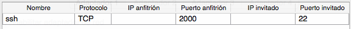
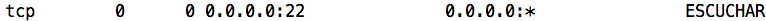
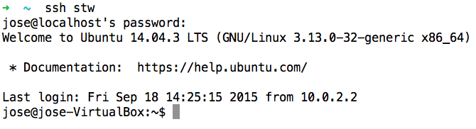
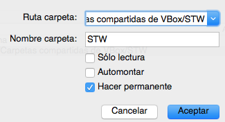
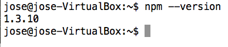

# Tarea inicial de la asignatura Sistemas y Tecnologías Web

## Introducción
Esta [tarea](https://campusvirtual.ull.es/1516/mod/assign/view.php?id=62097) está descrita en el [Campus](https://campusvirtual.ull.es/1516/course/view.php?id=187) de la asignatura.

Para esta asignatura, y para poder trabajar más comodamente durante el curso, he clonado una máquina virtual de 64 bits con ubuntu, en VirtualBox. Se trata de una instalación limpia y que solamente utilizaremos para el uso de la asignatura.

El registro en GitHub, Google+, y en Cloud9, no lo explicaré en este informe, debido a que ya lo habíamos realizado en la asignatura de Lenguajes y paradigmas de la Programación (asignatura que se imparte en el tercer curso del grado).

El sistema operativo de mi ordenador anfitrión es Yosmite y el de la máquina virtual es el Ubuntu 14.04.3 LTS.

### 1. Configuración de la máquina virtual

Para una mayor funcionalidad, vamos configurar el acceso a la máquina virtual desde el ordenador anfitrión utilizando, una configuración NAT con reenvío de puertos de la siguiente manera:

Seguidamente, comprobamos que el servidor SSH esté corriendo y escuchando el por el puerto 22.

    $ netstat -tuna

En el caso contrario, bastaría con instalar el ssh server.

En la máquina anfitriona, podermos, para facilitar el acceso a la máquina virtual, crear un fichero *"config"* y que configuraremos de la siguiente manera:

    #Ubuntu_STW
    Host stw # Nombre con el que llamaremos a la máquina.
    Hostname localhost
    User jose # nombre de usuario.
    Port 2000 # Puerto por el que nos conectaremos.
    
Una vez configurado lo anterior, podremos acceder mediante la terminal a nuestra máquina virtual, de la siguiente manera

    $ ssh stw
    
y... Listo!.

### 2. Configurar una carpeta compartida

Creamos una carpeta en el sistema anfitrion, la cual al ser compartida nos servirá para trabajar en los ficheros directamente desde cualquier sistema. Seguidamente accedemos a la configuración de virtualbox y lo dejamos así:

En el sistema virtual, creamos una carpeta(en nuestro caso, *"stw"*) y añadimos la siguiente línea en *$ /etc/fstab*

	Nombre_Carpeta_sist_Anf	 ruta_donde_montar	vboxsf	uid=1000,gid=1000	0	0
	
*Como nuestro sistema invitado es Ubuntu 14.04.3 LTS debemos introducir la siguiente línea, en */$ etc/modules* , para hacer que el módulo vboxsf, se cargue al arrancar el sistema.

	vboxsf
	
Reiniciamos y listo!.

### 3. Instalación de git y configuración con Github

Es tan fácil como:

    $ sudo apt-get install git

Para la configuración de la máquina virtual con Github, es recomendable seguir las instrucciones de generación de llaves ssh, de la página oficial. Estas son las [instrucciones](https://help.github.com/articles/generating-ssh-keys/).

### 4. Instalación de Atom
Para instalar Atom en cualquier sistema operativo, basta con descargarlo de su página [oficial](https://atom.io/).

*En la máquina virtual lo hemos instalado mediante la terminal:

    $ sudo add-apt-repository ppa:webupd8team/atom
	$ sudo apt-get update
	$ sudo apt-get install atom
	
### 5. Instalación de Node.js, npm y express.

Instalación de Node.js mediante la consola:

    $ sudo apt-get update
	$ sudo apt-get install nodejs

y para instalar Node.js package manager (npm):

	$ sudo apt-get install npm
	
El siguiente paso es comprobar que funcione npm:

Para instalar express utilizamos npm:

	$ npm install express --save

### 6. Instalación de Pandoc en Mac
Nos dirigimos al siguiente [enlace](https://github.com/jgm/pandoc/releases/tag/1.15.0.6), y lo descargamos.

